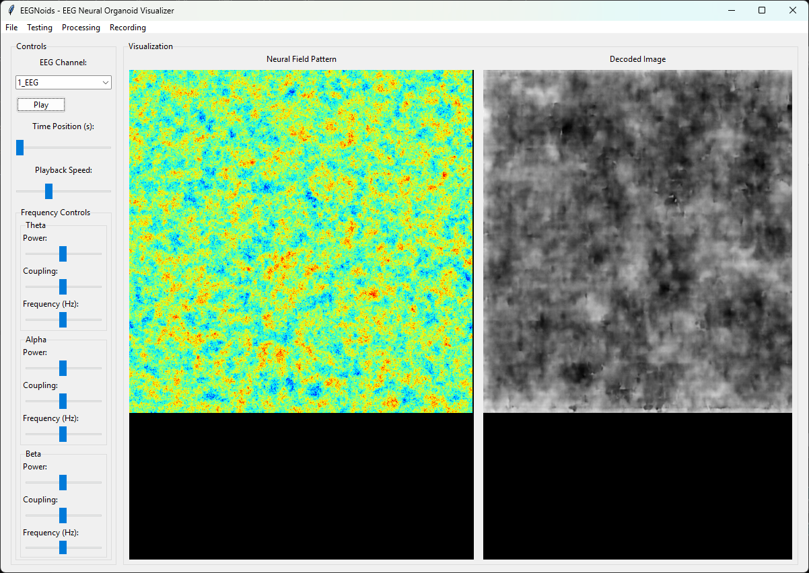

# Braindecoder3 (called eegnoids) - EEG Neural Field Pattern Visualizer



EEGNoids is a novel visualization tool that transforms EEG data into neural field patterns and attempts to decode potential embedded image patterns using a trained neural network.

## Overview

The system works in three main stages:

1. **EEG to Neural Field**: 
   - Converts EEG signals into dynamic neural field patterns
   - Maps different frequency bands (theta, alpha, beta, gamma) to varying scales of field structure
   - Uses wave equations and phase coupling to generate coherent field patterns

2. **Field Pattern Generation**:
   - Creates deterministic field patterns based on EEG frequency analysis
   - Applies band-specific coupling and power scaling
   - Generates real-time visualizations of the neural fields

3. **Pattern Decoding**:
   - Uses a trained U-Net model to decode the neural field patterns
   - Model is trained on paired image/field data to recognize potential patterns
   - Attempts to reconstruct possible associated imagery from the field patterns

## Features

- Real-time EEG visualization and processing
- Interactive frequency band control
- Adjustable coupling and power parameters
- Recording capabilities for field/decoded pairs
- Batch processing for multiple images
- Model training interface
- Test result logging and analysis

## Installation

1. Create a virtual environment:

```bash
python -m venv env
source env/bin/activate  # On Windows: env\Scripts\activate
```

2. Install requirements:
```bash
pip install -r requirements.txt
```

## Usage

Run the main application:
```bash
python app.py
```

load a EDF EEG and model. You can find a model trained with 1200 epochs from here: 

https://github.com/anttiluode/BrainDecoder2/

You can mess with the frequency couplings and power etc. To try to tease out image like features. 
They may be coming entirely from the latent space of the reverse image model, or.. Who knows.. 
The idea was that could eeg produce clusters of image like data that would cluster together 
with the image model and could we see somehow image like data coming from the brain. The idea 
with the frequencies is that finer (gamma) effect the fine detail (thought was that finer would 
modulate more v3 v4 and it sort of ares. (Perhaps utter BS) and lower frequencies effect more 
lower visual processing areas. But as it is, we do not know if we even get any visual data 
from the brain. 

The interface allows you to:
- Load EEG data files (.edf format)
- Adjust frequency band parameters
- View real-time neural field patterns
- Record visualization sessions
- Train and test the decoder model

## Research Context

This tool explores the potential relationship between EEG patterns and visual imagery through the medium of neural fields. By training the decoder on paired image/field data, the system attempts to identify and visualize possible clusters or patterns that might exist in the EEG data.

## Licence 

MIT
